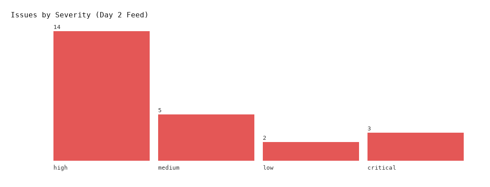
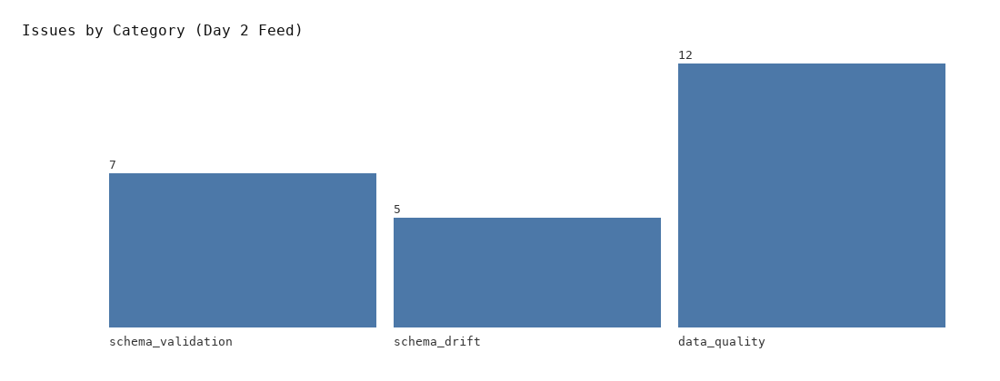
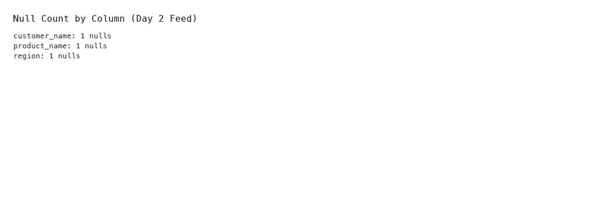
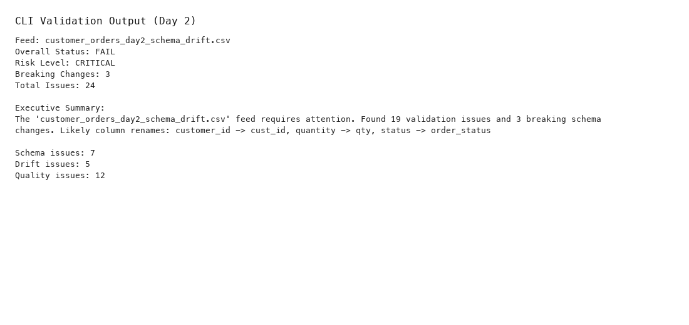
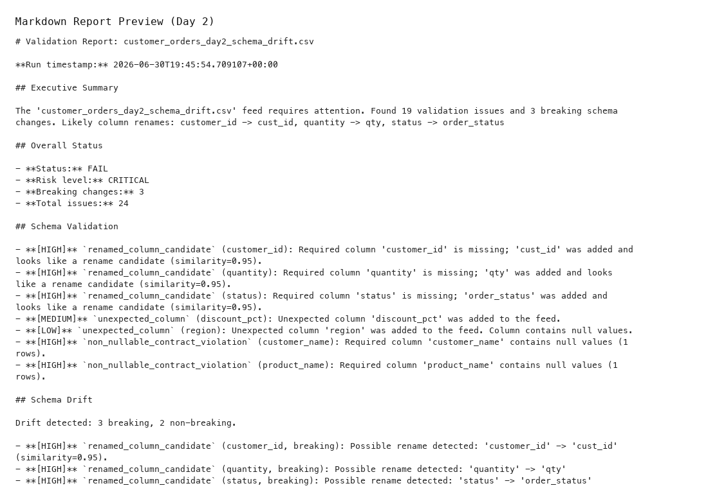

# AI Data Contract & Schema Drift Guardian

A local, no-cost data engineering tool that validates vendor data feeds against YAML data contracts, detects schema drift, runs data quality checks, and generates rule-based impact summaries — with CLI, reporting, and a Streamlit dashboard.

[](https://github.com/bhavyareddy/ai-data-contract-guardian/actions/workflows/ci.yml)
[](LICENSE)
[](https://www.python.org/downloads/)

> **Portfolio positioning:** This project demonstrates practical data engineering skills around vendor feed validation, schema drift detection, data contracts, data quality monitoring, report generation, and AI-style impact summaries.

---

## Business problem

Data teams receive feeds from vendors, partners, and internal services that can change without warning:

- Columns get renamed (`customer_id` → `cust_id`)
- Data types shift
- New fields appear; required fields disappear
- Data quality degrades silently

These changes cause **pipeline failures**, **broken dashboards**, **incorrect metrics**, and hours of reactive debugging.

---

## Why this project matters

This tool provides a **local-first guardrail** before bad data reaches production:

1. Define expected schemas and quality rules in version-controlled **YAML contracts**
2. Validate every incoming file automatically
3. Detect and classify **schema drift** (breaking vs non-breaking)
4. Run **data quality checks** with rename-aware logic
5. Generate **plain-English impact summaries** and exportable reports

No paid cloud services. No external AI API required.

---

## Architecture

```
  Incoming CSV
       │
       ▼
  ┌─────────────┐
  │ File Loader │
  └──────┬──────┘
         │
         ▼
  ┌──────────────┐    ┌─────────────────┐
  │Schema Profiler│    │ Contract Loader │
  └──────┬───────┘    └────────┬────────┘
         │                     │
         ▼                     ▼
  ┌──────────────────────────────────────┐
  │ Schema Validator                     │
  │ Data Quality Validator               │
  │ Drift Detector                       │
  └──────────────────┬───────────────────┘
                     │
                     ▼
  ┌──────────────────────────────────────┐
  │ Impact Summary Generator (rule-based)  │
  └──────────────────┬───────────────────┘
                     │
                     ▼
  ┌──────────────────────────────────────┐
  │ Report Writer → JSON / Markdown / CSV  │
  └──────────────────┬───────────────────┘
                     │
         ┌───────────┴───────────┐
         ▼                       ▼
      CLI (main.py)      Streamlit Dashboard
```

See [docs/architecture.md](docs/architecture.md) for module-level detail.

> **Screenshots:** Add dashboard and CLI captures under [docs/screenshots/](docs/screenshots/). An architecture screenshot can be added there after running the dashboard locally.

---

## Tech stack

| Layer | Technology |
|---|---|
| Language | Python 3.10+ |
| Data | Pandas, DuckDB |
| Contracts | YAML (PyYAML) |
| Dashboard | Streamlit |
| Testing | Pytest |
| CI | GitHub Actions |
| Summaries | Rule-based templates (no external AI API) |
| Storage | Local files only |

---

## Key features

- **YAML data contracts** — schema, dtypes, nullability, min/max, allowed values, regex, date formats
- **Schema validation** — missing columns, unexpected columns, dtype mismatches, rename candidates
- **Schema drift detection** — added / missing / renamed / dtype changes with breaking classification
- **Data quality checks** — nulls, uniqueness, ranges, allowed values, date formats, negative values
- **Rename-aware quality** — if `quantity` is missing but `qty` is detected, checks still run on `qty`
- **Impact summaries** — PASS / WARNING / FAIL, risk level, recommended actions, downstream impact
- **Report export** — JSON, Markdown, and CSV issue summaries
- **Streamlit dashboard** — interactive validation with charts and tabbed views
- **Makefile** — one-command install, test, run, and dashboard

---

## Quick start

```bash
git clone https://github.com/bhavyareddy/ai-data-contract-guardian.git
cd ai-data-contract-guardian

python -m venv venv
source venv/bin/activate   # Windows: venv\Scripts\activate

make install
make test
make run-day1
```

---

## How to run locally

### Makefile commands

| Command | Description |
|---|---|
| `make install` | Install dependencies from `requirements.txt` |
| `make test` | Run pytest |
| `make run-day1` | Validate clean baseline feed (expected **PASS**) |
| `make run-day2` | Validate drifted feed (expected **FAIL**) |
| `make dashboard` | Launch Streamlit UI |
| `make clean-reports` | Remove generated reports from `data/reports/` |
| `make screenshots` | Generate README chart assets in `docs/screenshots/` |

### CLI examples

```bash
# Day 1 — clean baseline
python main.py --file data/incoming/customer_orders_day1.csv

# Day 2 — schema drift + quality failures
python main.py --file data/incoming/customer_orders_day2_schema_drift.csv

# Custom contract and reports directory
python main.py \
  --file data/incoming/customer_orders_day1.csv \
  --contract config/data_contracts/customer_orders_contract.yml \
  --reports-dir data/reports
```

### Streamlit dashboard

```bash
make dashboard
# or
streamlit run src/app/streamlit_app.py
```

Select a CSV from `data/incoming/`, click **Run Validation**, and explore the tabs.

---

## Sample Day 1 result

```
Overall Status:    PASS
Risk Level:        LOW
Total Issues:      0
Breaking Changes:  0
```

Full console output: [docs/sample_outputs/day1_console_output.md](docs/sample_outputs/day1_console_output.md)

---

## Sample Day 2 result

```
Overall Status:    FAIL
Risk Level:        CRITICAL
Total Issues:      24
Breaking Changes:  3

Likely renames: customer_id → cust_id, quantity → qty, status → order_status
```

Key findings: rename candidates, new columns, null violations, invalid status values, date format drift, quantity range failures.

Full console output: [docs/sample_outputs/day2_console_output.md](docs/sample_outputs/day2_console_output.md)  
Markdown report preview: [docs/sample_outputs/day2_report_preview.md](docs/sample_outputs/day2_report_preview.md)

---

## Generated reports

Each run writes three files to `data/reports/`:

```
customer_orders_day1_validation_report.json
customer_orders_day1_validation_report.md
customer_orders_day1_issues.csv

customer_orders_day2_schema_drift_validation_report.json
customer_orders_day2_schema_drift_validation_report.md
customer_orders_day2_schema_drift_issues.csv
```

Reports are generated locally at runtime and are gitignored by default. See `.env.example` for optional path configuration.

---

## Project structure

```
ai-data-contract-guardian/
├── Makefile
├── LICENSE
├── main.py
├── requirements.txt
├── pytest.ini
├── .env.example
├── .github/workflows/ci.yml
├── config/data_contracts/
├── data/incoming/          # Sample feeds
├── data/reports/           # Generated at runtime
├── docs/
│   ├── architecture.md
│   ├── screenshots/        # Add real screenshots here
│   └── sample_outputs/
├── src/
│   ├── ingestion/
│   ├── profiling/
│   ├── contracts/
│   ├── validation/
│   ├── drift/
│   ├── summary/
│   ├── pipeline/
│   ├── reporting/
│   └── app/
└── tests/
```

---

## Interview design notes

### Rename detection

Uses abbreviation hints (`cust_id` → `customer_id`) plus `difflib.SequenceMatcher` and substring matching. Lightweight and explainable in interviews.

### Validation vs drift detection

| Concern | Question | Examples |
|---|---|---|
| **Validation** | Does the feed comply with the contract? | Missing columns, dtype mismatches, non-nullable violations |
| **Drift** | What schema change occurred? Is it breaking? | Added column, rename candidate, dtype change |

### Rename-aware quality checks

If a contract column is missing but a rename candidate exists, value-level checks (min/max, allowed values) still run against the candidate column.

### Rule-based summaries

Severity-weighted templates produce executive summaries, recommended actions, and downstream impact narratives — no external AI API.

### Why this solves a real problem

Vendor feeds change constantly. Contract validation catches issues **before** load time, reducing pipeline incidents and debugging time. This mirrors patterns used in modern data platforms (contracts, quality gates, observability).

---

## What this demonstrates as a data engineer

- Designing **modular Python pipelines** with clear separation of concerns
- Implementing **data contracts** as version-controlled YAML
- Building **schema drift** and **quality monitoring** tooling
- Writing **testable, interview-friendly** code with pytest
- Delivering **CLI + dashboard + reporting** for multiple audiences
- Using **GitHub Actions** for CI and **Makefile** for developer experience
- Documenting architecture and sample outputs for portfolio review

---

## Screenshots

Pipeline-generated preview images (from real Day 2 validation output):

| Preview | Description |
|---|---|
|  | Issues by severity |
|  | Issues by category |
|  | Null count by column |
|  | CLI summary (Day 2) |
|  | Markdown report preview |

Regenerate assets anytime:

```bash
python scripts/generate_screenshot_assets.py
```

For live Streamlit UI captures, run `make dashboard` and save additional PNGs to `docs/screenshots/`. See [docs/screenshots/README.md](docs/screenshots/README.md).

---

## Future enhancements

- [ ] Historical drift tracking with DuckDB persistent storage
- [ ] Slack/email alerting for breaking changes
- [ ] GitHub Actions contract validation on PR (data file changes)
- [ ] Great Expectations integration
- [ ] Optional local LLM summaries (Ollama) — still no required paid API
- [ ] Parquet, JSON, and API-based sources
- [ ] Airflow / dbt integration
- [ ] pip-installable package

---

## License

MIT — see [LICENSE](LICENSE).

---

## Contributing

Contributions welcome. Please open an issue or submit a pull request.
